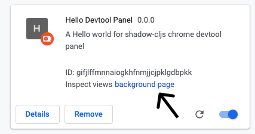

# Shadow-cljs Chrome Extension Devtool Panel


## Development

```bash
yarn install
yarn dev
```

### Load the dev extension into the Chrome browser

1. Go to `chrome://extensions/`
2. Turn on **developer mode** in top right
3. Load unpacked `your-file-path-to/chrome-extension-hello-world/shells/chrome`


To view the background page click here



To view the datalog panel open the Chrome console with either of these options.
- Right click anywhere on the page -> Inspect
- **Option + ⌘ + J**   (on macOS)
- **Shift + CTRL + J** (on Windows/Linux)

## Connect REPL

You can connect a repl to each process by opening new windows in your terminal and doing the following.


- `yarn repl-background` - for the background page
- `yarn repl-panel` - for the devtool panel console

### Tips

These are convenient things to know for working at the repl
- `(require 'clojure.string 'clojure.repl)`
- `(namespace ::x)` - find out the namespace
- `(clojure.repl/dir my-ns)` - replace `my-ns` with the ns not using a string. This will list the vars of that namespace


## Quirks

Execution of code inside of `content-script` will not run on `www.google.com`